  

  <b>Informatics Engineering @ ISEP</b> &nbsp;·&nbsp; Portugal &nbsp;·&nbsp; CCNA certified

  <a href="https://www.linkedin.com/in/davidsbrandao"><b>LinkedIn</b></a>
  &nbsp;&nbsp;/&nbsp;&nbsp;
  <a href="mailto:david.s.brandao@outlook.com"><b>Email</b></a>
  &nbsp;&nbsp;/&nbsp;&nbsp;
  <a href="./David_Brandao_CV.pdf"><b>View CV</b></a>

## About me

I'm pursuing a **BSc in Informatics Engineering at ISEP** (2024–2027), with a focus on **cloud architecture and AWS**. I build serverless backends, automate infrastructure with Terraform, and use networking fundamentals to understand how the pieces fit together.

Previously, I worked as a **Full-Stack Developer Intern at ROQ Group**, developing internal .NET applications and SQL-backed workflows. Today, my projects explore event-driven systems, performance and the trade-offs behind architectural decisions.

## Selected projects

<table>
  <tr>
    <td width="50%" valign="top">
      01 / CLOUD ARCHITECTURE
      <h3><a href="https://github.com/david-s-brandao/risk_assistant">Risk Assistant</a></h3>
      
A serverless threat-analysis backend built for a <b>48-hour team hackathon</b>. I designed and implemented the AWS architecture, from authenticated APIs to asynchronous processing and Amazon Bedrock integration.

      
<b>Engineering focus:</b> SQS with a dead-letter queue, content caching, and an architecture review documenting recovery, IAM and fail-safe improvements.

      
<code>AWS</code> <code>Terraform</code> <code>Python</code> <code>Bedrock</code>

      
<a href="https://github.com/david-s-brandao/risk_assistant#architecture">Explore the architecture &rarr;</a>

    </td>
    <td width="50%" valign="top">
      02 / PERFORMANCE &amp; OBSERVABILITY
      <h3><a href="https://github.com/david-s-brandao/runtime_benchmark_lambda">Lambda Runtime Benchmark</a></h3>
      
Compared <b>Rust, Java 21 and Java 21 + SnapStart</b> across <b>2,000 successful invocations per configuration</b>, with automated workloads and CloudWatch log analysis.

      
<b>Measured in this run:</b> Rust had ~10× lower observed cold-invocation latency, ~78% lower memory use and ~81% lower billed duration than baseline Java.

      
<code>Lambda</code> <code>Rust</code> <code>Java 21</code> <code>CloudWatch</code>

      
<a href="https://github.com/david-s-brandao/runtime_benchmark_lambda#at-a-glance">Read the results &rarr;</a>

    </td>
  </tr>
  <tr>
    <td colspan="2" valign="top">
      03 / NETWORKING &amp; AUTOMATION
      <h3><a href="https://github.com/david-s-brandao/automated-cisco-campus-network">Automated Multi-Site Network</a></h3>
      
Designed and validated a <b>three-site lab on physical Cisco hardware</b>, using OSPF over GRE/IPsec, VLANs and HSRP. Built Ansible tooling for configuration backups and operational checks, with documentation distinguishing configured intent from verified live state.

      
<code>Cisco IOS</code> <code>OSPF</code> <code>GRE/IPsec</code> <code>Ansible</code>

      
<a href="https://github.com/david-s-brandao/automated-cisco-campus-network#lab-demonstrations">See the lab &rarr;</a>

    </td>
  </tr>
</table>

## Certifications & next steps

| Milestone | Status | Timeline |
| :--- | :--- | :--- |
| **Cisco Certified Network Associate (CCNA)** | Certified | August 2026 |
| **AWS Certified Solutions Architect – Associate (SAA-C03)** | In progress · exam scheduled | October 2026 |
| **AI Business Strategist** | Planned | By December 2026 |

## Technical toolkit

| Area | Technologies |
| :--- | :--- |
| **Cloud & AWS** | Lambda · API Gateway · SQS/SNS · S3 · DynamoDB · Cognito · Bedrock · CloudWatch · EC2 · VPC · IAM · RDS |
| **Infrastructure & automation** | Terraform · Ansible · Docker · Linux · Bash · Git |
| **Networking** | TCP/IP · IPv4/IPv6 · VLANs · OSPF · GRE/IPsec · HSRP · NAT · ACLs · DHCP |
| **Programming** | Python · Java · C · C# · SQL |

## Highlights

- **AWS European Community GameDay 2026** — 1st place in Portugal · 80th of 427 teams across Europe.
- **Best Project Award @ ISEP** — [All Aboard](https://github.com/david-s-brandao/All-Aboard), a first-year integrative engineering project.
- **AWS Academy Cloud Architecting** — hands-on training in AWS architecture and core services.

## Writing about cloud

I share what I learn about architecture, reliability and cloud fundamentals on **AWS Builder Center**.

- [AI Is Making Fundamentals More Important, Not Less](https://builder.aws.com/content/3IkU8g3AArOpQsxy2TvpZz2ayF3/ai-is-making-fundamentals-more-important-not-less)
- [What If I Randomly Tried To Kill Your AWS Infrastructure?](https://builder.aws.com/content/3IvYf0HUrzoqaTfEvreXNUjEi8u/what-if-i-randomly-tried-to-kill-your-aws-infrastructure)
- [Here's What You Need to Know About AWS TechU](https://builder.aws.com/content/3JsgGDNBmnkuEeClSRzrkbpiMqG/heres-what-you-need-to-know-about-aws-techu)

---

  <b>Build it. Measure it. Understand the trade-offs.</b> 
  Portuguese (native) · English (C1) · Bass player for 7+ years

